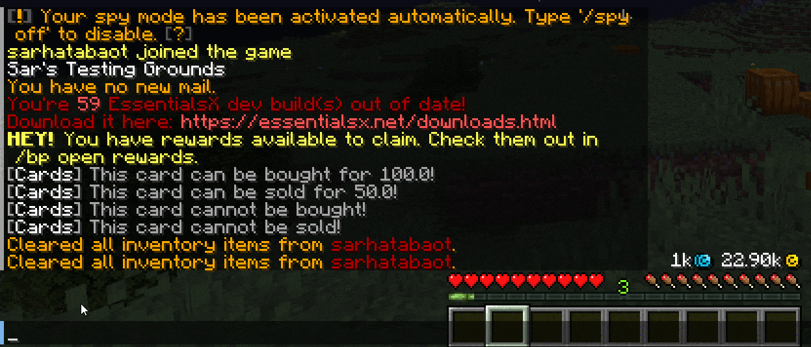

Use `/deck <deckNumber>` to access one of your deck slots.

### Obtain Item

<figure><figcaption></figcaption></figure>

### Open Directly

To open the deck directly instead of receiving a deck item, set `use-deck-item: false` in [`general.yml`](../../customizing/settings/general.md).

The exact deck size is controlled by `deck-rows`, and creative-mode access depends on `decks-in-creative`.
