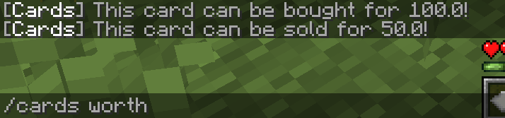
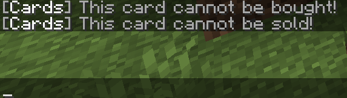

Use this command to display the sell & buy worth of a pack or card in your inventory.

This is useful for checking whether an item can be sold, whether it has a buy price configured, and whether the item is tradeable at all.

<figure><figcaption></figcaption></figure>

 

<figure><figcaption>
Un-tradeable card
</figcaption></figure>

